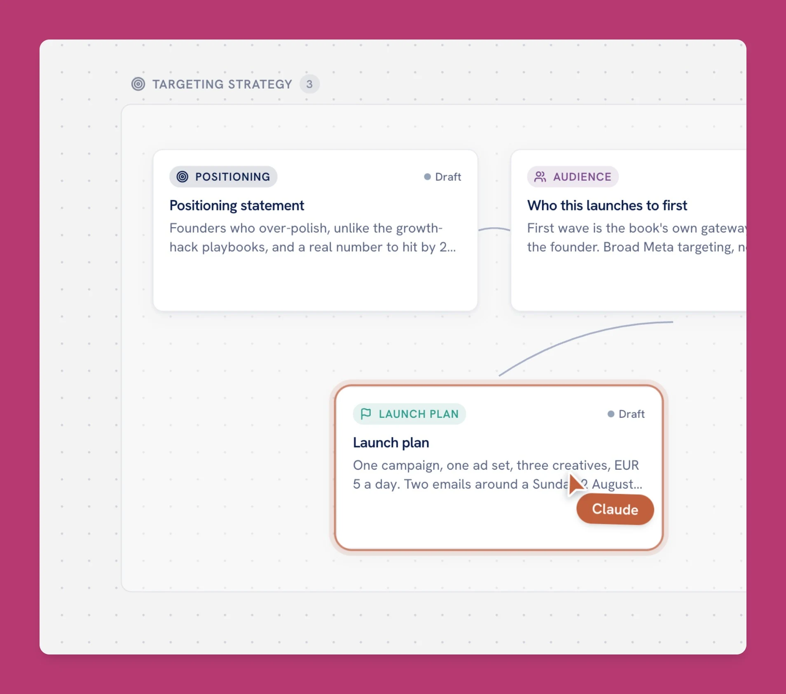

# Plainpaper for Claude

Plan, write and approve your marketing campaigns with Claude, on a board you can see. Ask Claude for
a Black Friday plan, a product launch or a welcome email series, and watch it build on your
Plainpaper board: the brief, the audience, the offer, every email and every ad as separate cards.
Each one waits for your approval. Close the chat whenever you like: in any new conversation, Claude
reads the board back and carries on where you stopped.

## Try asking

- "Plan my Black Friday and Cyber Monday campaign. We sell handmade candles on Shopify."
- "Write a five-email welcome series for new subscribers and put it on a board for review."
- "Plan the launch of our new winter boot as a board I can approve piece by piece."
- "Where were we with the launch board? What's waiting for my approval?"
- "The Black Friday emails are approved. Put them into Klaviyo as drafts."

## What's in the plugin

**The Plainpaper connector.** Claude reads and writes your boards through Plainpaper's MCP server at
`https://mcp.plainpaper.io/mcp`. The first time, you sign in with your Plainpaper account; signing up
is free and the free plan holds two boards.

**Four skills** that teach Claude how to run a campaign on the board:

| Skill | When it runs |
|---|---|
| `plainpaper-plan-campaign` | You ask for a campaign: a launch, welcome emails, a winback flow, a content calendar, ads and more. Claude picks the playbook that fits, asks a few questions, builds the board and shares the link. |
| `plainpaper-black-friday` | You mention Black Friday, Cyber Monday or BFCM. Claude plans the offer, five emails and the ads, timed backwards from 27 November. |
| `plainpaper-continue-board` | You come back later. Claude reads the board, tells you what's waiting for you, works through your comments and carries on. |
| `plainpaper-ship-approved` | You ask to send or schedule approved work. Claude pushes it through Klaviyo's, Mailchimp's, Brevo's or Meta's own connector and records where it went. |

## How it behaves

- **You approve everything.** Claude marks finished work as waiting for your approval and never
  approves on your behalf unless you say so in the chat.
- **Plainpaper never sends or posts anything.** It doesn't hold your email or ad platform logins.
  Shipping happens through those platforms' own connectors, and only for cards you approved.
- **Your brand rules apply.** If you set up brand guidelines in Plainpaper (voice, colors, logos,
  writing rules), Claude reads them before it writes.

## What it connects to and stores

The skills are plain instructions; the plugin runs no local code. The only connection it adds is
Plainpaper's MCP server (`https://mcp.plainpaper.io/mcp`), which stores your boards, cards and
uploaded media in your private Plainpaper workspace, hosted in the EU. See the
[privacy policy](https://plainpaper.io/privacy) and [docs](https://plainpaper.io/docs). Questions:
[hello@plainpaper.io](mailto:hello@plainpaper.io).

## Licence

[MIT](LICENSE).
